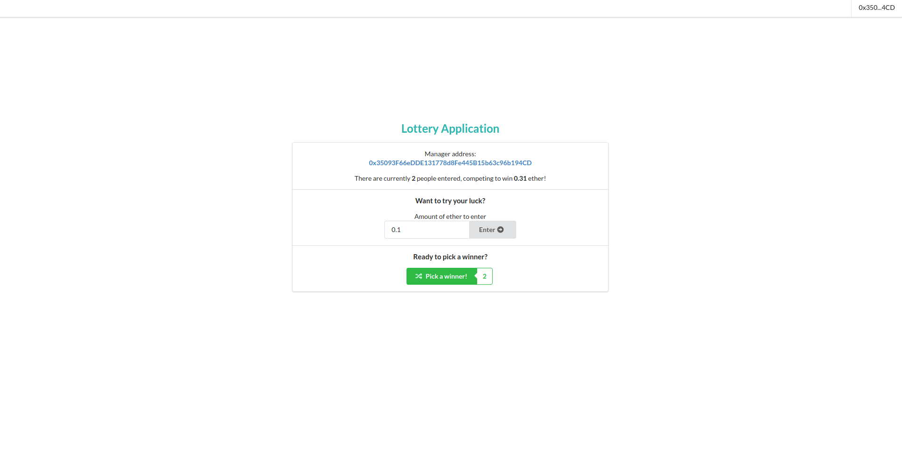

# Lottery Contract
Anyone with 0.1 etherium can enter the lottery. The person who deployed Contract can draw lottery. When the draw is over, the money will be transferred to the winner's account.

### Application Screenshot

### How to use?
- first install metamask on [here](https://metamask.io/download)
- git pull https://github.com/basyusuf/lottery-chain.git
- cd lottery-chain/contract && npm run deploy
- copy address and abi on terminal
- cd ../frontend/src/lotter.js and paste items
- and npm run start on frontend
- go to url http://localhost:3000/